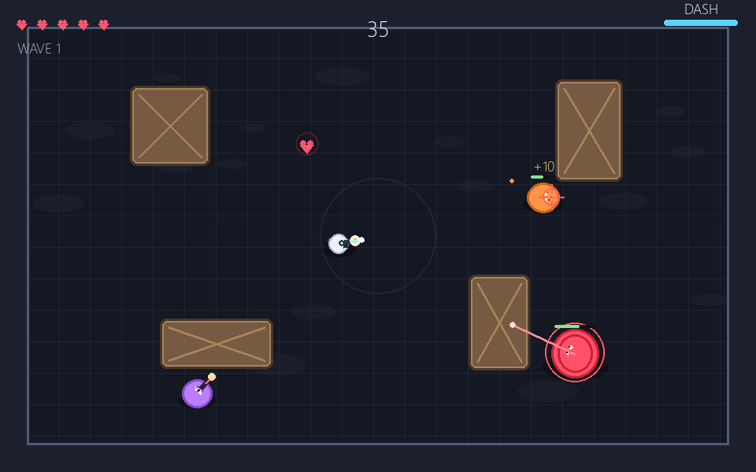
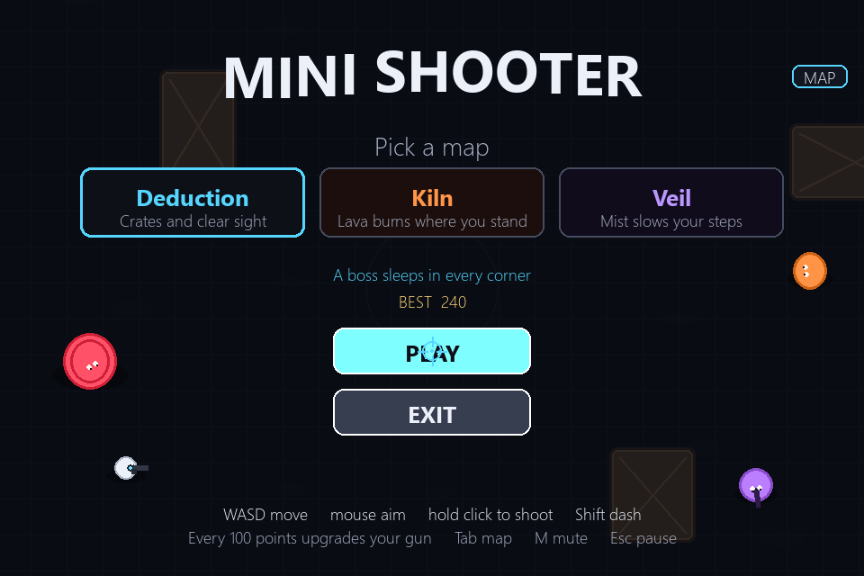
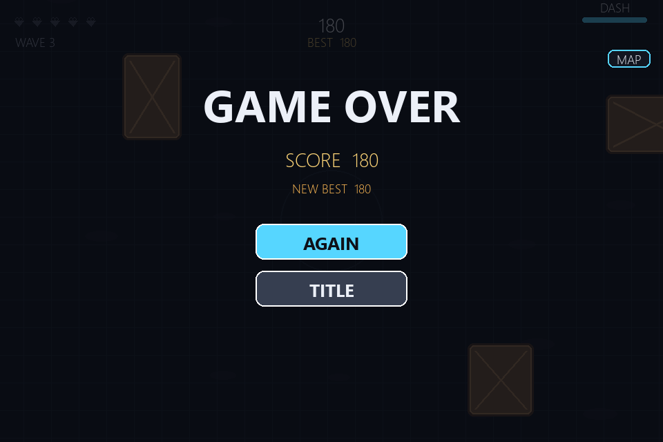

# Mini Shooter

A tiny original arena shooter written in Python with [Pygame](https://www.pygame.org/).
Move with the keyboard, aim with the mouse, and hold the button to fire. Waves of
enemies close in across a small arena. Dash through their shots, duck behind crates,
and grab hearts before the next wave starts.



## Screenshots

| Title | In the arena | Game over |
| --- | --- | --- |
|  |  |  |

## Features

- **Aim and shoot**: the gun tracks the cursor, kicks back, and throws a muzzle flash. Bullets leave a short trail.
- **Three maps**, picked on the title screen. **Deduction** is the open crate floor. **Kiln** has lava pools that burn if you stand in them, and tougher waves. **Veil** has mist that slows your steps, and more shooters. The side panel and buttons take on that map's colors.
- **Secret bosses** sleep in all four corners of every map. Walk into a corner and one wakes up. Beating it pays a big score and a free weapon upgrade. They do not appear on the map until they wake.
- **A bigger map**: the arena is larger than the window. The view follows you. The side panel shows the whole floor, the crates, the enemies, and your dot moving through it. Press `Tab`, or click **MAP** / **HIDE**, to open and close that panel. Your choice is remembered.
- **Weapon upgrades**: every 100 points the fight pauses and you pick one boost. Rapid shoots faster, Spread fires a fan, Heavy hits harder, and Pierce lets shots pass through enemies. Each can be taken up to three times.
- **Dash**: Shift bursts you across the floor and leaves afterimages. You slip through enemy shots while dashing.
- **Three enemies**: orange grunts that chase, purple shooters that hang back and fire, and big red brutes that telegraph a charge with a line, then rush.
- **Cover**: wooden crates stop you and stop bullets. A brute that charges into one slams to a halt.
- **Hearts**: you start with 5. Brutes drop a heart. Picking one up heals you, or scores 50 points if you are already full.
- **Waves**: each clear pays a bonus and the next wave brings more enemies. Shooters show up from wave 2, and a brute joins every third wave.
- **Juice**: dust when you run, sparks and rings when something dies, floating scores, a short freeze on a brute kill, and screen shake.
- **Best score** is saved on this computer as soon as you beat it, shown under the score while you play, and kept on the title screen.
- **A small tune for each map** plays only while you fight. Deduction is a clear high line, Kiln is a low heated pulse, and Veil is a slow chord. The title screen and the game over screen stay quiet. Shots, hits, and explosions are still little synthesized sounds. Press `M` to mute.
- **No asset files.** The characters, crates, particles, music, and sound effects are all drawn and synthesized in code.

## Getting started

You need **Python 3.8+**.

```bash
git clone https://github.com/yugdogra0/mini-shooter.git
cd mini-shooter
pip install -r requirements.txt
python game.py
```

## Controls

| Action | Keys / mouse |
| --- | --- |
| Move | `W` `A` `S` `D` or the arrow keys |
| Aim | Mouse |
| Shoot | Hold the left mouse button |
| Dash | `Shift` |
| Pick an upgrade | Click a card, or press `1` `2` `3` |
| Start / play again | Click **Play** or **Again** (or press `Enter` or `Space`) |
| Pause | `Esc`, then **Resume** or **Title** |
| Show / hide the map | `Tab`, or click **MAP** / **HIDE** |
| Mute / unmute | `M` |
| Quit | Click **Exit** (or press `Esc` on the title screen) |

## How to play

- The floor is bigger than the screen. Walk and the view follows. Open the map on the side when you want to see enemies coming and where the crates are.
- Every 100 points, pick a weapon upgrade before the fight continues. The bar on the side shows how close the next one is.
- Clear every enemy in the wave. A banner announces the next one, and you get a moment to move before they spawn nearby.
- Grunts walk straight at you. Two shots stop one. Touching an enemy costs a heart.
- Shooters keep their distance and fire slow orange shots. Crates block those shots, so step behind one instead of eating the bullet.
- A brute pauses, draws a line toward you, then charges faster than you can run. Sidestep or dash. It takes a lot of shots, shakes the screen when it goes down, and drops a heart.
- After a hit you blink and cannot be hurt again for a short moment. Use that to get out of a pile of grunts.
- The dash meter at the top right refills after each dash. It is the reliable way through a charge or a tight volley.
- Lose all 5 hearts and the run ends. Your best score stays on the title screen.

## Tweaking the game

Feel settings live in `shooter/settings.py`:

```python
PLAYER_SPEED = 245         # how fast you run
DASH_SPEED = 640           # burst speed
DASH_TIME = 0.16           # how long a dash lasts
DASH_COOLDOWN = 0.82       # seconds before you can dash again
FIRE_COOLDOWN = 0.14       # delay between shots
PLAYER_BULLET_SPEED = 700
ENEMY_BULLET_SPEED = 255
MAX_HEARTS = 5
HURT_TIME = 0.95           # invincible time after a hit
```

Enemy health, speed, size, and points are the `STATS` table in `shooter/actors.py`.
Wave size is `wave_kinds()` in `shooter/game.py`: wave 1 is three grunts, later waves add shooters, and every third wave from wave 3 adds a brute.

## Project structure

```
mini-shooter/
├── game.py              # launcher: python game.py
├── shooter/             # the game package (also runs with: python -m shooter)
│   ├── game.py          # arena loop: waves, collisions, menus, drawing
│   ├── actors.py        # player, enemies, bullets, hearts, and their animation
│   ├── fx.py            # sparks, rings, shell casings, floating scores
│   ├── audio.py         # one tune per map, and the shot sounds
│   ├── maps.py          # Deduction, Kiln, and Veil
│   ├── settings.py      # window size, colours, and tuning knobs
│   └── scores.py        # the best score saved on this computer
├── requirements.txt     # pygame dependency
├── screenshots/         # images used in this README
└── README.md
```
